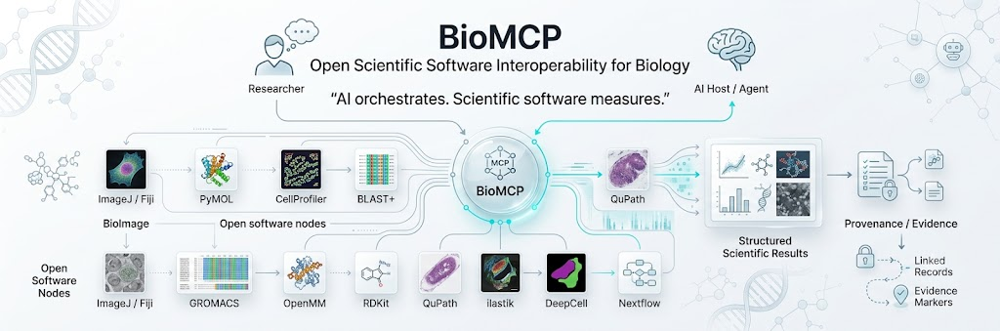

# BioMCP

<p align="center">
  
</p>

<p align="center">
  <strong>Scientific software interoperability through the Model Context Protocol.</strong>
</p>

BioMCP is an open source framework for integrating scientific applications, command line tools, model runtimes and external MCP services through standardized interfaces. It provides the integration boundary between an MCP client and a scientific backend. It does not replace the backend application or duplicate its scientific algorithms.

## What is BioMCP?

Scientific computing environments combine desktop applications, command line programs, Python libraries, model servers and analysis pipelines. These components expose different invocation models, configuration requirements, input conventions and output formats.

BioMCP provides a common MCP interface for these heterogeneous systems.

```text
MCP Client
    |
    v
Capability Discovery
    |
    v
BioMCP Registry
    |
    v
Request Validation
    |
    v
BioMCP Runtime
    |
    v
Scientific Adapter
    |
    v
Scientific Software / Model Runtime / External MCP Server
    |
    v
Structured Result + Execution Metadata
```

The registry, runtime and adapters belong to BioMCP. The scientific backend remains responsible for domain specific computation.

## Why BioMCP?

The principal problem is interoperability.

A microscopy application, structural biology program, sequence analysis executable and model runtime may all provide useful capabilities while exposing incompatible interfaces. A client should not require a different integration mechanism for every application.

BioMCP defines an adapter boundary between protocol level requests and application specific execution.

```text
Application specific interface
            |
            v
+--------------------------------+
|          BioMCP Adapter        |
|                                |
| MCP schema                     |
| input validation               |
| configuration                  |
| execution control              |
| error handling                 |
| result normalization           |
| provenance metadata             |
+--------------------------------+
            |
            v
       Standard MCP interface
```

The purpose is to expose existing scientific capabilities through a consistent protocol and execution model without reproducing the underlying scientific implementation.

## System architecture

BioMCP is organized around four functional areas.

### Registry

`src/biomcp/registry.json` contains machine readable integration metadata. Entries describe lifecycle state, installation metadata, executable command, transport and exposed capabilities where applicable.

### Runtime

The runtime resolves registered integrations, prepares configuration, validates requests and starts or connects to the selected service.

### Adapters

Adapters translate typed MCP tool calls into the native invocation model of the backend. A backend may be a Python package, executable, local application, model endpoint or external MCP service.

### Results

Adapters return structured output. Where supported, results may include artifacts, software identity, parameters, execution metadata and provenance.

## Technical execution flow

A typical operation follows this sequence:

```text
Client request
      |
      v
MCP tool schema
      |
      v
Input validation
      |
      v
Registry resolution
      |
      v
Configuration resolution
      |
      v
Execution boundary
      |
      v
Scientific backend
      |
      v
Result collection
      |
      v
Structured MCP response
```

The execution mechanism depends on the adapter. Supported integration patterns can include local Python execution, subprocess execution, HTTP requests and connections to external MCP servers.

## Current implementation

The current installable server families are deliberately limited.

| Integration | Interface | State |
|---|---|---|
| **BioImage** | Local image inspection, intensity summaries and thresholding primitives | Experimental, installable |
| **ImageJ / Fiji** | Controlled bridge to an explicitly configured local runtime | Experimental, installable |
| **LLM Gateway** | Initial OpenAI compatible model bridge | Experimental, installable |
| **BioNuclei** | Independent external MCP server | Validated, external, not bundled |

Lifecycle state is conservative.

`Planned` means roadmap scope without an installable implementation.

`Experimental` means executable integration work exists but the complete validation gate has not been satisfied.

`Validated` means documented evidence supports the stated lifecycle status.

`External` means the scientific system is maintained outside this repository.

## Registry driven integration model

BioMCP grows through explicit adapters rather than duplicated scientific implementations.

```text
MCP Tool
   |
   +--> Input schema
   |
   +--> Validation
   |
   +--> Execution preparation
   |
   +--> Backend invocation
   |
   +--> Result normalization
   |
   +--> Metadata / provenance
```

A new integration should identify the upstream project, supported interface, executable requirements, input and output contract, execution model and validation requirements.

### Planned v0.3 integrations

| Software | Intended scope |
|---|---|
| **PyMOL** | Molecular visualization and structural biology workflows |
| **CellProfiler** | Reproducible bioimage analysis pipelines |
| **BLAST+** | Local sequence similarity analysis |

These are roadmap entries until executable adapters and corresponding validation evidence exist.

Later candidates include napari, QuPath, ilastik, Cellpose, DeepCell, StarDist, ChimeraX, VMD, RDKit, OpenMM, GROMACS, HMMER, BWA, Bowtie2, STAR, samtools, bcftools, GATK, Nextflow and Snakemake. Candidate status does not imply implementation.

## LLM Gateway

The LLM component is an experimental model runtime interface. Its purpose is model access and controlled orchestration. It is not a scientific computation engine.

```text
MCP Client / Scientific Agent
            |
            v
+--------------------------------------+
|            LLM Gateway               |
|                                      |
| provider registry                    |
| model discovery                      |
| request validation                   |
| generation interface                 |
| streaming                            |
| structured output                    |
| tool calling                         |
| MCP capability discovery             |
| controlled MCP execution             |
| context / session limits             |
| provider capability metadata         |
| usage metadata                       |
| timeout / retry / response limits    |
| credential isolation                 |
| error normalization                  |
| provenance metadata                  |
+------------------+-------------------+
                   |
        +----------+----------+
        |          |          |
        v          v          v
 OpenAI          Ollama     vLLM / custom
 compatible      local      endpoint
```

The target gateway provides a common interface over compatible hosted and local model endpoints. Planned capabilities include model discovery, streaming, structured outputs, JSON schema, tool calling, MCP capability discovery, controlled execution, context limits, provider metadata and operational controls.

The current repository contains the initial bridge foundation. The broader gateway remains under development and should not be represented as fully validated.

Current configuration for the experimental bridge is:

```text
BIOMCP_LLM_BASE_URL=...
BIOMCP_LLM_API_KEY=...
BIOMCP_LLM_MODEL=...
```

`OPENAI_API_KEY` is accepted as a fallback by the current bridge.

## Scientific execution boundary

BioMCP separates protocol handling from scientific computation.

```text
MCP Client
    |
    v
BioMCP
    |
    +-- capability discovery
    +-- request validation
    +-- configuration
    +-- execution controls
    v
Scientific Software
    |
    +-- computation
    +-- measurement
    +-- inference
    +-- artifact generation
    v
BioMCP
    |
    +-- structured result
    +-- supported metadata
    v
MCP Client
```

When a language model participates in the workflow, model output is an orchestration or interpretation layer. The scientific backend remains responsible for the underlying result.

BioMCP does not copy or reimplement the BioNuclei scientific engine. BioNuclei remains responsible for its scientific computation, models, measurements, evaluation, artifacts and provenance.

## Scientific tool contract

A BioMCP tool should behave as a typed scientific API.

| Contract element | Requirement |
|---|---|
| Capability | Scientific purpose of the operation |
| Inputs | Types, units, ranges and file requirements |
| Outputs | Result schema and artifact semantics |
| Dependencies | Executables, libraries, models or data assets |
| Execution | Process, network and resource requirements |
| Failure | Expected errors and incomplete result behavior |
| Provenance | Software identity, versions and relevant parameters |
| Validation | Lifecycle state and validation evidence |

A failed operation remains a failed operation. An adapter must not convert an execution failure into a plausible looking scientific result.

## Security and execution controls

Scientific integrations may execute local processes, external programs and network services. Execution boundaries are therefore part of adapter design.

Relevant controls include:

* input and parameter validation
* path validation
* bounded file handling and decompression
* controlled subprocess environments
* timeout enforcement
* bounded output sizes
* restricted credential inheritance
* endpoint validation
* sanitized provider and subprocess errors
* explicit network requirements
* reproducible configuration

The exact controls depend on the backend and are validated at the adapter level.

## Validation and engineering results

BioMCP treats interoperability as an executable property.

```text
Source implementation
        |
        v
Unit tests
        |
        v
Integration tests
        |
        v
Actual MCP client / server exchange
        |
        v
Package build
        |
        v
Wheel installation outside source tree
        |
        v
Installed artifact execution
        |
        v
Source distribution validation
        |
        v
CI evidence
```

The package validation path has been exercised through actual MCP client sessions for the installable server families, including installed wheel and source distribution consumer checks. Security regression coverage also verifies that selected subprocess based integrations do not inherit unrelated execution control variables or credentials by default.

The validation model is intentionally stronger than source import tests. A capability is considered validated only when the corresponding implementation, protocol path, packaging and project specific checks provide sufficient evidence.

## Command line interface

Install the package:

```bash
pip install biomcp
```

Inspect the registry and environment:

```bash
biomcp list
biomcp doctor
```

Run current server families:

```bash
biomcp run bioimage
biomcp run imagej
biomcp run llm
```

Generate client configuration:

```bash
biomcp install --servers bioimage --clients generic
```

Preview configuration without writing files:

```bash
biomcp install --servers bioimage --clients generic --dry-run
```

## Client configuration

Current configuration workflows include generic MCP configuration, Claude Desktop and Codex oriented configuration.

```bash
biomcp install --servers bioimage,imagej,llm --clients claude-desktop
biomcp install --servers bioimage,llm --clients codex
```

Generated configuration references concrete server commands. Generating configuration does not make a planned integration executable.

## Package structure

BioMCP is distributed as the Python package `biomcp`.

```text
BioMCP/
├── src/
│   ├── biomcp/
│   │   └── registry.json
│   └── biomcp_servers/
│       ├── bioimage.py
│       ├── imagej.py
│       └── llm.py
├── tests/
├── docs/
├── pyproject.toml
└── .github/workflows/
```

Current console entry points include:

```text
biomcp
biomcp-bioimage
biomcp-imagej
biomcp-llm
```

Optional dependency groups are provided for integration families and testing.

## Development installation

```bash
git clone https://github.com/BurhanAbdullah/BioMCP.git
cd BioMCP
python -m venv .venv
```

Activate the virtual environment and install development dependencies:

```bash
python -m pip install --upgrade pip
pip install -e '.[test]'
pytest
```

For the image integration:

```bash
pip install 'biomcp[bioimage]'
```

ImageJ/Fiji requires an explicitly configured local installation.

## Contribution model

New integrations should be focused adapters around a defined scientific use case.

```text
Scientific use case
      |
      v
Upstream software identified
      |
      v
Registry entry
      |
      v
Adapter implementation
      |
      v
Typed MCP contract
      |
      v
Unit / integration tests
      |
      v
MCP interoperability validation
      |
      v
Packaging validation
      |
      v
Documentation
      |
      v
Experimental
      |
      v
Security / CI / reproducibility evidence
      |
      v
Validated
```

A contribution should document why MCP interoperability is useful, how the upstream software is invoked, how inputs and outputs are represented, what resources and credentials are required, and how execution is validated.

## Roadmap

### Platform foundation

* Formalize registry schema and versioning.
* Expand capability metadata and discovery.
* Increase MCP protocol regression coverage.
* Expand installed artifact validation.
* Strengthen image resource and decompression limits.
* Harden ImageJ/Fiji timeout and environment isolation.

### LLM Gateway

* Provider abstraction.
* Model discovery.
* Provider capability metadata.
* Structured output contracts.
* Bounded streaming.
* Tool calling.
* Controlled MCP capability discovery and execution.
* Context and session limits.
* Credential isolation.
* Endpoint validation.
* Error normalization.
* Provider interoperability tests.

### Scientific ecosystem

* PyMOL.
* CellProfiler.
* BLAST+.
* Additional adapters selected by scientific utility, technical fit, security and maintainability.

## Design principles

1. Scientific computation remains in the scientific software.
2. BioMCP provides interoperability rather than duplicated domain algorithms.
3. Registry state corresponds to executable reality.
4. MCP interoperability is tested through real protocol paths where practical.
5. Installed artifacts are validated independently of the source tree.
6. Execution environments are explicitly bounded.
7. Scientific outputs are structured and inspectable.
8. Provenance accompanies results where supported by the backend.
9. Experimental, validated, planned and external capabilities remain distinct.
10. Integration quality matters more than the number of integrations.

## Status

BioMCP is an active scientific software infrastructure project. The current release contains a small set of executable integrations and the platform foundation required to expand them.

The project is conservative about capability claims. An upstream application being open source does not imply that a BioMCP adapter exists. A documented adapter does not automatically imply validation. Lifecycle state is tied to implementation and test evidence.

## License

BioMCP is released under the MIT License.

## Links

* Repository: https://github.com/BurhanAbdullah/BioMCP
* BioMCP technical page: https://burhanabdullah.github.io/BioNuclei-DomainRobust/biomcp.html
* Community: https://burhanabdullah.github.io/BioNuclei-DomainRobust/community.html
