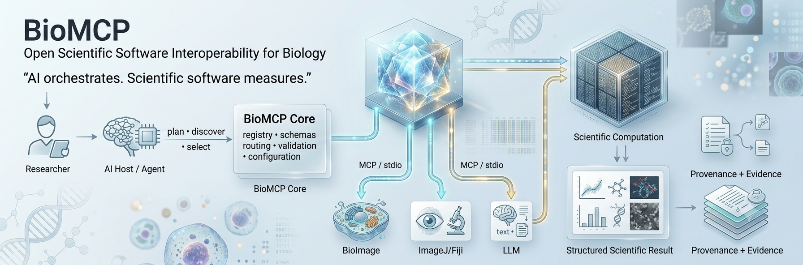

# BioMCP

<p align="center">
  
</p>

**The open MCP platform for biology, bioinformatics, bioimaging, and scientific AI.**

> **AI orchestrates. Scientific software measures.**

BioMCP is a modular, open-source interoperability platform that lets AI agents discover and invoke real scientific software through the Model Context Protocol (MCP). It is designed as scientific infrastructure—not as a replacement for domain software and not as a black-box claim generator.

## Why BioMCP?

Modern biological research already has powerful tools for microscopy, image analysis, modeling, sequence analysis, visualization, and workflow execution. The missing layer is often **interoperability**: a researcher should be able to ask an AI system for a scientific task while the actual measurement remains with the validated software that knows how to perform it.

BioMCP provides that layer. The platform architecture is shown below.

<p align="center">
  
</p>

### Core execution model

```text
Researcher
    │
    ▼
AI host / agent
    │  plan • discover • select
    ▼
┌───────────────────────────────┐
│            BioMCP             │
│ registry • schemas • routing  │
│ validation • configuration    │
└───────────────┬───────────────┘
                │ MCP / stdio
       ┌────────┼────────┐
       ▼        ▼        ▼
   BioImage   ImageJ/Fiji   LLM
       │        │        │
       └────────┼────────┘
                ▼
       scientific computation
                │
                ▼
       structured result
       + provenance/evidence
```

The agent can plan and explain. The underlying scientific server performs the computation.

## Platform at a glance

| Capability | Purpose |
|---|---|
| **Unified package** | Install the BioMCP platform with one Python package |
| **Registry** | Machine-readable server capabilities, status, transport and installation metadata |
| **Independent servers** | Keep scientific integrations modular and replaceable |
| **MCP stdio** | Standard local agent-to-tool interoperability |
| **CLI** | Discover, install, launch and diagnose integrations |
| **Client configuration** | Generate supported MCP host configuration instead of manual editing |
| **Diagnostics** | Detect configuration and environment problems early |
| **Evidence-first testing** | Validate source, wheel and sdist consumers through real MCP paths |

## Current server families

### BioImage
Local image inspection, intensity summaries, thresholding and related quantitative image primitives.

```bash
biomcp run bioimage
```

### ImageJ / Fiji
A controlled bridge to an explicitly configured local ImageJ/Fiji installation.

```bash
biomcp run imagej
```

### LLM Bridge
OpenAI-compatible model connectivity for agent workflows using environment-provided configuration.

```bash
biomcp run llm
```

### BioNuclei — external validated adapter
BioMCP can expose the independent BioNuclei MCP server without copying its scientific engine into this repository. Scientific implementation and validation remain under BioNuclei's authority.

## Open-source integration expansion

BioMCP is designed to grow into a broad interoperability layer over the open scientific software ecosystem. Integrations will be added incrementally and promoted only after executable implementation, tests, documentation, packaging, and validation evidence exist.

### v0.3 — first three new integrations

1. **PyMOL** — molecular visualization and structural-biology workflows.
2. **CellProfiler** — reproducible bioimage-analysis pipelines.
3. **BLAST+** — local sequence-similarity analysis.

These are initially catalogued as **planned**. Their registry state will move to experimental and then validated only when the corresponding adapters pass the project gates.

### v0.4+ — expansion candidates

The roadmap includes Napari, QuPath, Cellpose, ilastik, UCSF ChimeraX, VMD, RDKit, OpenMM, GROMACS, Biopython, HMMER, samtools, bcftools, BWA, Bowtie2, STAR, FreeBayes, Nextflow, Snakemake, and additional open scientific tools selected by community demand and technical fit.

See [`docs/integrations.md`](docs/integrations.md) for the phased integration contract and lifecycle.

## Quick start

```bash
pip install biomcp
biomcp list
biomcp doctor
biomcp install --servers bioimage --clients generic
```

For image-analysis dependencies:

```bash
pip install 'biomcp[bioimage]'
```

## Configure AI hosts

```bash
biomcp install --servers bioimage,imagej,llm --clients claude-desktop
biomcp install --servers bioimage,llm --clients codex
```

Preview configuration changes before writing them:

```bash
biomcp install --servers bioimage --clients generic --dry-run
```

## Local configuration

ImageJ/Fiji:

```text
BIOMCP_IMAGEJ_EXECUTABLE=/path/to/ImageJ-or-Fiji
```

LLM bridge:

```text
BIOMCP_LLM_BASE_URL=...
BIOMCP_LLM_API_KEY=...
BIOMCP_LLM_MODEL=...
```

`OPENAI_API_KEY` is accepted as an API-key fallback.

## Registry-first design

The machine-readable registry is the authoritative description of the platform's integration surface. Every entry declares its validation state and whether it is installable. Current lifecycle states are:

- **Planned** — catalogued future integration; not installable.
- **Experimental** — runnable integration under active validation.
- **Validated** — executable integration with tests and documented evidence.
- **Deprecated** — retained for compatibility/history but not recommended.

This prevents the documentation, installer and scientific claims from silently drifting apart.

## Scientific tool contract

A mature BioMCP operation should behave like a scientific API, not an unconstrained prompt. Its contract should make explicit:

- purpose and capability;
- input and output schemas;
- preconditions and validation constraints;
- deterministic or stochastic behavior;
- software and version identity;
- dataset/sample provenance where applicable;
- artifacts and evidence;
- failure modes and safe error behavior.

## Reproducibility and trust

BioMCP treats an integration as incomplete if it merely works from the source tree. The project validates installed artifacts and real MCP communication paths, while security-sensitive subprocess boundaries are explicitly controlled.

The guiding rule is simple:

> **A generated explanation is not a scientific measurement.**

Scientific conclusions should remain traceable to the executable operation and evidence that produced them.

## Four-pillar research ecosystem

BioMCP is one layer of a broader scientific-AI architecture:

- **BioFM** — domain-aware vision and multimodal foundation-model research for biological imagery.
- **BioMCP** — typed agent-to-tool interoperability.
- **BioWF** — reproducible, versioned and auditable scientific workflow composition.
- **BioSkills** — reusable protocols, validation rules, failure-mode checks and scientific procedures.

These layers are complementary. Future layers are explicitly marked as research directions until their implementations and validation evidence exist.

## Roadmap

### Platform engineering

- strengthen resource and decompression limits for image handling;
- harden ImageJ/Fiji subprocess timeouts and environment isolation;
- validate LLM endpoints and bound response sizes;
- formalize registry schema/versioning and capability metadata;
- expand Linux/macOS/Windows CI and end-to-end tests.

### Ecosystem

- deliver the v0.3 PyMOL, CellProfiler and BLAST+ adapters;
- expand into workflow, structural-biology, pathology, microscopy and sequence-analysis ecosystems;
- configuration templates for major MCP-capable AI hosts;
- benchmark suites for tool selection, reliability, protocol compliance and evidence fidelity.

Each integration must earn its status through executable code, tests, documentation and evidence.

## Development

```bash
pip install -e '.[test]'
pytest
```

Contributions should preserve the platform's scientific boundary and must not turn planned capabilities into undocumented claims.

## Website

The documentation/product site is maintained in [`docs/`](docs/) and published through GitHub Pages.

## License

MIT.
